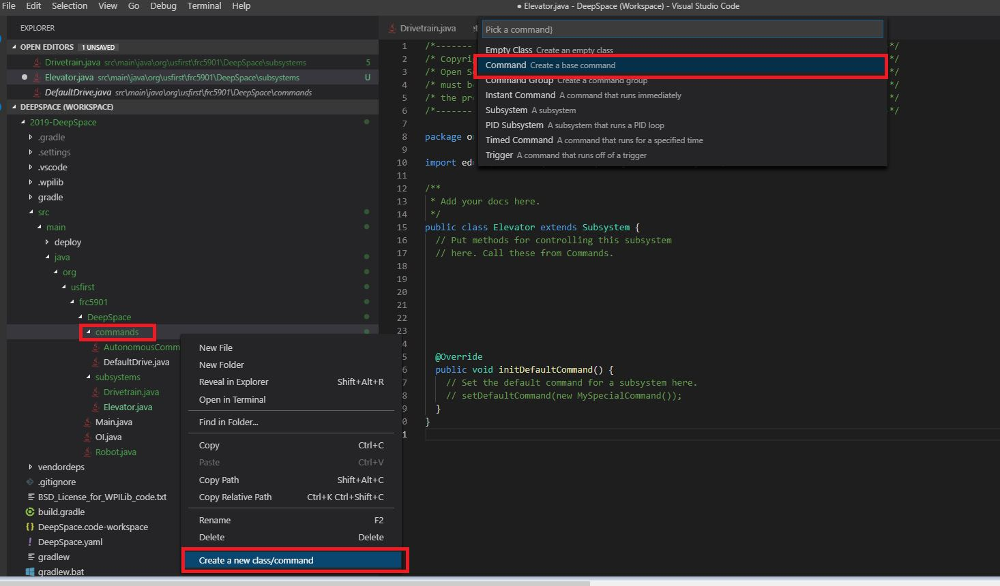

# Overview
Controllers are operated by human players in order to command the robot.
In this section, you will create the controller and button objects in Java.
If you have completed the [command section](commands.md), you can then assign commands to specific button.

## Creating a Joystick Object

To create a **`joystick`**, you must declare the object and initialize it.

The example below declares to the program that there is an object named CONTROLLERNAME that is a joystick.   
This should be placed under publc class OI 

```
public Joystick CONTROLLERNAME
```

You must then instantiate (create) and object and assign it a port number.   
The port number tells the computer which USB slot this controller should be in.
```
NAME = new Joystick(NUMBER)
```

## Creating Button Objects

To create a **`button`**, you must declare the object and initialize it.
Declaring tells the program that there is an object named NAME that is a button. This should be placed under **`public OI`**.
Depending on the controller, each button (X,Y,A,B, etc.) is assigned to a number. 



```
JoystickButton buttonA = new JoystickButton(CONTROLLERNAME,BUTTONNUMBER)
```
Change BUTTONNUMBER to the number of the button you want.
Change CONTROLLERNAME to the name of the controller you want to assign the button to.


## Assigning Commands to Buttons

NOTE: To complete this section, you must have completed the [command section](commands.md) of the is guide.

Depending on your design, you may want your buttons to behave differently.
Here are 3 possible button types you can use, depending on your application.

**whenPressed** - Command starts when button is pressed, and it runs **until** the command's **`isFinished`** method is satisfied.
```
button.whenPressed(new ExampleCommand());
```

**whileHeld** - Command runs while button is held down, and is **`interrupted`** once the button is released. The command will then run the command's interupted method.
```
button.whileHeld(new ExampleCommand());
```

**whenReleased** - Start command when button is released, and run **until** the command's **`isFinished`** method is satisfied.
```
button.whenReleased(new ExampleCommand());
```


## Example - Create controller and a button that will run the command raiseElevator
```
public class OI {

	//Controller1 is a joystick
    public Joystick Controller1;		

    public OI() {

		//Controller1 is assigned to USB port 0  
        Controller1 = new Joystick(0);  	

		//ButtonY (button 4) is on Controller1,
        JoystickButton buttonY = new JoystickButton(Controller1, 4);	
        
		//Runs raiseElevator until button is released, which triggers raiseElevatorsCommand isInteruptted method
        buttonY.whileHeld(new raiseElevatorCommand());						
    }
}
```