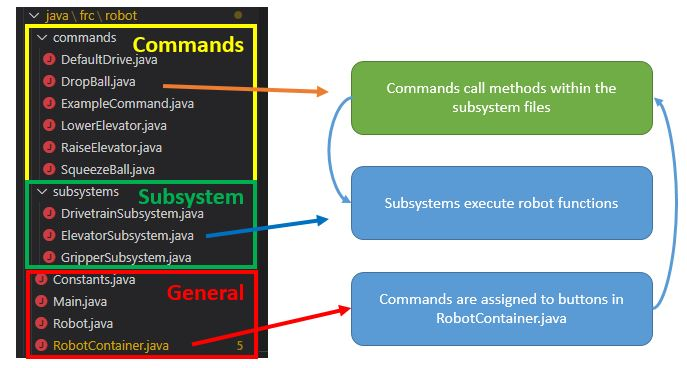
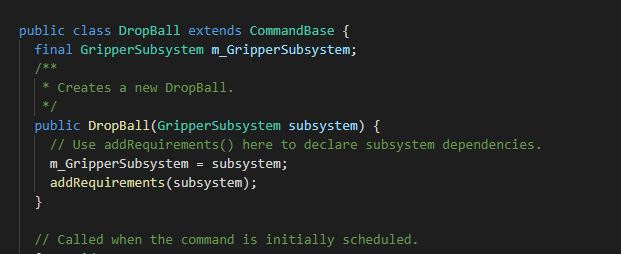
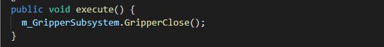
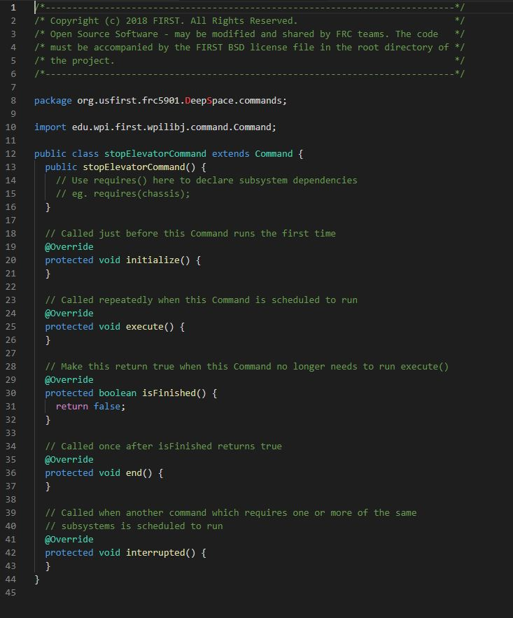

# Overview
Commands are used to execute robot functions.   
Commands call methods of subsystems to execute a task.



## Creating Commands

To create a command, right click subsystems in the explorer and select **`Create a new class/command `**.   
Select  **`command`**, and then name the command appropriately using CamelCase. 
For example, the command to stop an elevator should be named **`StopElevator`**.
  


When you are done, a new .java file will be created under command.

## Requiring Subsystems

The next thing to think about is if your command **`requires`** a subsystem.  
A command the `requires` a subsystem will automatically interrupt any other command that subsystem is running if needed.

Example: What happens if **`raiseElevatorCommand`** is run the same time as **`lowerElevatorCommand`**?   

To ensure both never run at the same time, we should require the subsystem for both commands.

If this command requires  control of the subsystem, add the following code under the constructor, `public COMMANDNAME()`

Under the class:
```
final <subsystem><subsystem name>;
```

Under the constructor:

```
<subsystem name> = subsystem;
addRequirements(subsystem);
```
Example: 




## Calling Subsystem Methods
The command requests the subsystem to perform a function, such as turn on a motor.   
For example, the following code will call on subsystem **`Elevator`**, and it's method **`stopElevator`** using the following code:

```
<subsystem name>.<method name>();
```



The next question is, where should this code be placed? See the next section for details.

## Code Placement

* **protected void initialize()** - Code placed here will one run **once** when the command is run
* **protected void execute()** - Code placed here will run **continously** as long as the command is running
* **protected void isFinished()** - Code placed here determines **when** the command stops
* **protected void end()** - Code placed here runs once the command is **over**
* **protected void interrupted()** - Code placed here runs if the commands is **interrupted** by another command that requires the subsystem. Most of the time, you should run the `end()` command in this method.




