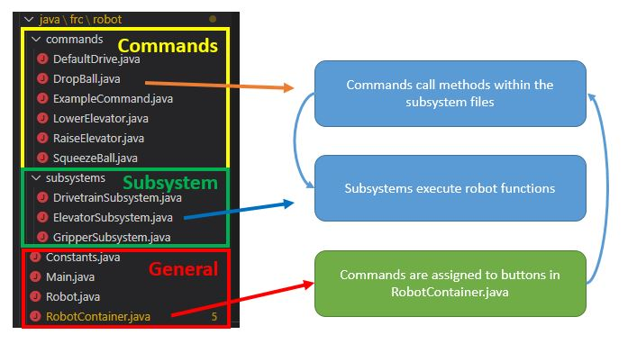
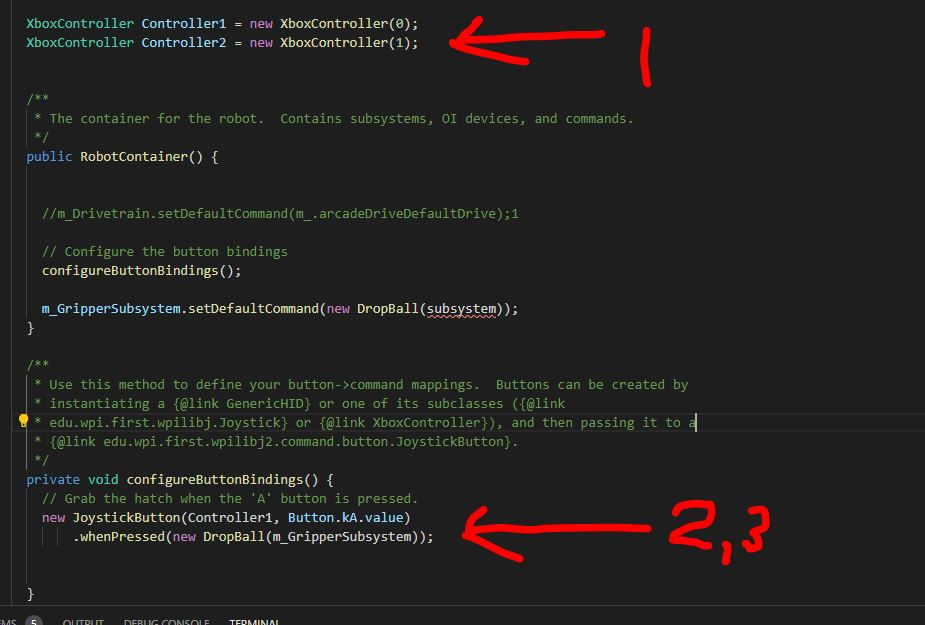

# Overview
Controllers are operated by human players in order to command the robot.
In this section, you will create the controller and button objects in Java.
If you have completed the [command section](Basic - Commands.md), you can then assign commands to specific button.



## 1. Creating a Joystick Object

The example below declares to the program that there is an object named <controllername> that is a `XBoxController`.     
This should be placed under **`public class OI`**.        
The port number tells the computer which USB slot this controller should be in.     

```
XboxController <controllername> = new XboxController(0);
```

## 2. Creating Button Objects 

In the example above, we create a button on a xbox controller named `<controllerName>`.     
**Note: Joysticks and the trigger are NOT considered buttons since their value can vary between 0 and 1**

Syntax

```
new JoystickButton(<controllername>, <buttontype>)
```

Button | Description | Example
-------|-------------|--------
kA		| A button | new JoystickButton(Controller1,button.kA.value)
kB		| B button | new JoystickButton(Controller1,button.kB.value)
kX		| X button | new JoystickButton(Controller1,button.kX.value)
kY		| Y button | new JoystickButton(Controller1,button.kY.value)
kBack	| Back button | new JoystickButton(Controller1,button.kBack.value)
kStart	| Start button | new JoystickButton(Controller1,button.kStart.value)
kBumperLeft | Left Bumper | new JoystickButton(Controller1,button.kBumperLeft.value)
kBumperRight| Right Bumper | new JoystickButton(Controller1,button.kBumperRight.value)
kStickLeft | Left stick press | new JoystickButton(Controller1,button.kStickLeft.value)
kStickRight | Right stick press | new JoystickButton(Controller1,button.kStickRight.value)


## 3. Assigning Commands to Buttons

NOTE: To complete this section, you must have completed the [command section](Basic - Commands.md) of the is guide.

Depending on your design, you may want your buttons to behave differently.
Here are 3 possible button types you can use, depending on your application.

Add this immediately after you have created your button object.

###### whenPressed
Command starts when button is pressed, and it runs **until** the command's **`isFinished()`** method is satisfied.
```
.whenPressed(new ExampleCommand());
```

###### whileHeld (Most Common)
Command runs while button is held down, and is **interrupted** once the button is released. Note that interrupting a command does NOT automatically end it! You will need to modify the `interrupted()` method in the command by anding end(); to make sure it stops.
```
.whileHeld(new ExampleCommand());
```

###### whenReleased
Start command when button is released, and run **until** the command's **`isFinished()`** method is satisfied.
```
.whenReleased(new ExampleCommand());
```

###### ExampleCommand
