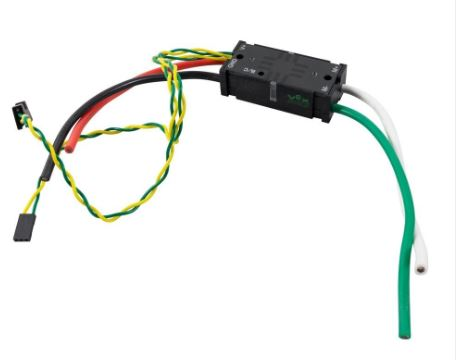

# Overview
Motor controllers control motors by sending controlled levels of voltage to a motor.   
In this section, you will learn to and create motor controller objects in Java.     
You will then create the methods that control these components.

## Creating a TalonSRX Object


Place this in the class constructor under `public class <Subsystem_name> extends SubsystemBase`
```
private final WPI_TalonSRX <motorcontrollername> = new  WPI_TalonSRX(X);
```

The number **X** corresponds to the CANId of the motor controller.     
Each motor controller has a unique CANId to make sure the correct one is called.

## Creating a VictorSP Object  



Place this under `public class <Subsystem_name> extends SubsystemBase`

```
private final WPI_VictorSPX <motorcontrollername> = new WPI_VictorSPX(X);
```

The number **X** corresponds to the CANId of the motor controller.


## Creating Motor Controller Methods
A method is a function of the subsystem.     
Other parts of code can call the method, which will automatically run the block of code between the {}.
This allows for code to be reused throughout the program.

To create a method, place the following code before the final bracket.     
Be sure to name the method starting with a lowercase letter, then camelCase.

```  
public void <method_name>(){

}
```

If you would like to pass a parameter into the method, use the following syntax.    
Multiple parameters can be passed if needed. 

```  
public void <method_name>(<datatype> <parameter_name>){

}
```

Methods should be placed at the bottom of the subsystem, but still contained within the class like so:


# Motor Controller Functions

Each motor controler comes with a pre-built library of common functions.
The most common are below:

Methods | Description | Example
------- | ----------- | -------
set | if control mode = PercentOutpuit, value of [-1,1]  | LeftElevatorMotor.set(1.0);
setInverted | switches rotation of motor (by default, positive values are counterclockwise, negative values are clockwise)  | LeftElevatorMotor.setInverted(true) 
stopMotor| stops motor | LeftElevatorMotor.stopmotor();


For a full description, see the following links     
[TalonSRX API](https://www.ctr-electronics.com/downloads/api/archive_4.4.X/hero_cs/class_c_t_r_e_1_1_talon_srx.html)     
[VictorSP API](https://first.wpi.edu/FRC/roborio/beta/docs/java/edu/wpi/first/wpilibj/VictorSP.html)     


#Example
A function of an elevator may be to lift to a certain height, lower, or to stop.     
The motors controlling the elevator will push the elevator in a certain direction.
 
To do the above, the following functions were created:


This sets the elevator motor that we created earlier at a certain value.
For example, to stop the elevator, we could call setElevator(0.0) to stop the elevator motors.


