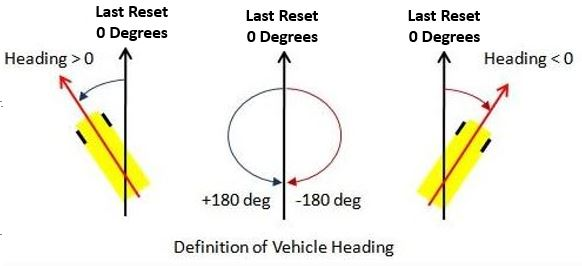
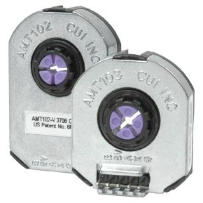

# Overview
Sensors are used to help the Robot understand the world around it.     
Using sensors, we can make robots react to the environment around them instead of depending on the driver to act.     
Here is sumamry of a few sensors we may use in the competition.     

Type| Description 
----|------------
Gyros | Determines change in heading of the robot. 
Encoders | Counts rotations of an axle. Typically used to count axle rotations to determine distance/velocity of the rotation
Limit Switches | Used for object detection. When in contact with an object, will send a different signal
Ultrasonics | Used to distance or object detection. Used only for short distances.
Color sensor | Used to determine color of an object. 

# Gyros


Gyros measure heading of the robot to determine what direction it is going in.   
0 Degrees is defined as the angle the robot was facing when the gyro was last reset.



** Creating a Gyro object **     
Place under `public class <SUBSYSTEM> extends Subsystem`.
```
public static ADXRS450_Gyro GYRONAME = new ADXRS450_Gyro();
```
** Usage **     
Function | Description | Example usage
---------|-------------|--------------
getAngle()| get angle from gyro | &lt;examplename>.getAngle();
reset()| reset gyro heading to zero | &lt;examplename>.reset();	


#Encoders

Encoders count the revolutions of an axle.     
By understanding how many times an axle/wheel rotates, we can estimate the distance traveled.

** AMT103-V - 5901's Drivetrain Encoder   ** 



5901 has used this encoder as a drivetrain encoder for years.

** Creating a AMT103-V Encoder Object **     
place under `public class <SUBSYSTEM> extends Subsystem`

```	
public static Encoder <encodername> = new Encoder(0, 1, false, Encoder.EncodingType.k1X) ;

```


** Parameter Setting (to be placed in Constants.java**     
```
static double diameter = MEASURE_THIS; // inches
static double distancePerRev = diameter * Math.PI;    
static int ticksPerRev = 2048; // what you set them to , before was 2048

leftEncoder = new Encoder(0, 1, false, Encoder.EncodingType.k1X);        
leftEncoder.setDistancePerPulse(distancePerRev / ticksPerRev);      	
leftEncoder.setReverseDirection(true);		//Depends on if your mechanism runs counterclockwise or clockwise
leftEncoder.setMaxPeriod(.1);
leftEncoder.setMinRate(10);	
leftEncoder.setSamplesToAverage(7);
```
	
** CTRE Magnetic Encoder - 5901's Mechanism Encoder **

** Creating on object **
```
None! CTRE encoders are wired directly into a TalonSRX, which serves as the object
```


** Parameter Setting **
```
TALONNAME.configSelectedFeedbackSensor(FeedbackDevice.CTRE_MagEncoder_Absolute, 0,0);
TALONNAME.configSelectedFeedbackSensor(FeedbackDevice.CTRE_MagEncoder_Relative, 0,0);
```
```

//Set current position to 0
int sensorPos=0;
elevatorEbony1.setSelectedSensorPosition(sensorPos, 0,10);

elevatorEbony1.configOpenloopRamp(1.5,0);
elevatorIvory7.configOpenloopRamp(1.5,0);

elevatorIvory7.set(com.ctre.phoenix.motorcontrol.ControlMode.Follower, 1);

elevatorEbony1.configForwardSoftLimitThreshold(36000,0);
elevatorEbony1.configReverseSoftLimitThreshold(0,0);
elevatorEbony1.configForwardSoftLimitEnable(true, 0);
elevatorEbony1.configReverseSoftLimitEnable(true, 0);

		elevatorEbony1.configNominalOutputForward(0, 0);
elevatorEbony1.configNominalOutputReverse(0, 0);
elevatorIvory7.configNominalOutputForward(0, 0);
elevatorIvory7.configNominalOutputReverse(0, 0);
elevatorEbony1.configPeakOutputForward(.5,0);    
elevatorEbony1.configPeakOutputReverse(-.5,0);
elevatorIvory7.configPeakOutputForward(.5,0);    
elevatorIvory7.configPeakOutputReverse(-.5,0);
```
# Limit Switch

** Creating a Limit Switch Object **     
```
public static DigitalInput <LimitSwitchName> = new Digital Input (X)
		
```

where X relates to the digital I/O port on the RoboRio.

#Ultrasonics 

How do ultrasonics work?


** Creating a ultrasonic object **     
```
private static final int kUltrasonicPort = 0; // 
private static final double kValueToInches = 0.125;	//Converts returned voltage to inches
private final AnalogInput m_ultrasonic = new AnalogInput(kUltrasonicPort);
```

** Usage **
```
m_ultrasonic.getValue() * kValueToInches; // Converts signal to inches
```


#Color Sensor


** Creating a color sensor object **     
```
private final I2C.Port i2cPort = i2C.Port.kOnboard;
private final ColorSensorV3 m_colorSensor = new ColorSensorV3(i2cPort);
private final ColorMatch m_colorMatcher = new ColorMatch();
```

** Defining color calibrations **    
Colors are defined by 3 numbers that define their Red/Green/Blue values (RGB).     
Use the following website to determine initial calibrations: [RGB Calculator](https://rgbcolorcode.com/)     


```
public static final Color kBlueTarget = ColorMatch.makeColor(0.136, 0.412, 0.450);
public static final Color kGreenTarget = ColorMatch.makeColor(0.196, 0.557, 0.246);
public static final Color kRedTarget = ColorMatch.makeColor(0.475, 0.371, 0.153);
public static final Color kYellowTarget = ColorMatch.makeColor(0.293, 0.561, 0.144);
```

** Usage **     
Adds the colors that the robot should matched based on the above colors

```
m_colorMatcher.addColorMatch(kBlueTarget);
m_colorMatcher.addColorMatch(kGreenTarget);
m_colorMatcher.addColorMatch(kRedTarget);
m_colorMatcher.addColorMatch(kYellowTarget);  
Color detectedColor = m_colorSensor.getColor();

String colorString;
ColorMatchResult match = m_colorMatcher.matchClosestColor(detectedColor);

if (match.color == kBlueTarget) {
  colorString = "Blue";
} else if (match.color == kRedTarget) {
  colorString = "Red";
} else if (match.color == kGreenTarget) {
  colorString = "Green";
} else if (match.color == kYellowTarget) {
  colorString = "Yellow";
} else {
  colorString = "Unknown";
}

SmartDashboard.putNumber("Red", detectedColor.red);
SmartDashboard.putNumber("Green", detectedColor.green);
SmartDashboard.putNumber("Blue", detectedColor.blue);
SmartDashboard.putNumber("Confidence", match.confidence);
SmartDashboard.putString("Detected Color", colorString);
```