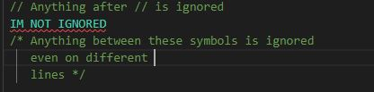
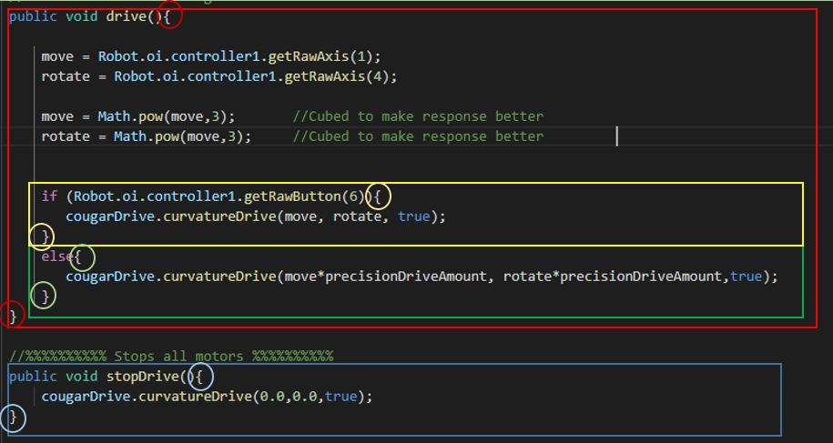

# Overview
For the FIRST Robotics competition, the team will use the programming language Java.
There are several rules we keep to try to keep our code clean and working.

## Key Project Files
* Robot.Java - Main robot class run when robot boots up
* OI.java - Maps commands to controller buttons
* Command files - Contains instructions for using the subsystem
* Subsystem files - Contain all the functions of a subsystem

## Programming Guidlines

1. __Comment your code__  
Anything after **`//`** or surrounded by `/*` and `*/`is ignored by the program and will turn green. Use this to explain sections of code.

2. **Name objects appropriately in CamelCase**
All objects should be named CamelCase, where the first letter of each word is capitalized.
The exception to this rule is methods, which the first word is lowercase: raiseElevatorComand

3. __No spaces in names__  
 Java doesnt like spaces.

4. **All statements must end with** **`;`**

5. **Blocks of code are contained within brackets** **`{ }`**.    
You can have blocks of code within blocks of code!    
In the below example, the colored circles mark the beginning `{` and ending `}` of each block of code.   
Note that the yellow and green blocks of code are within the red block of code, meaning that they may be run if the red block of code is run! 
The blue block of code is completely seperate.   

