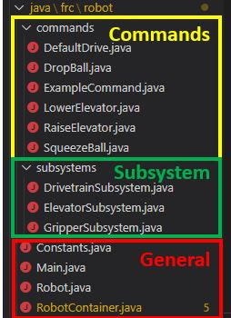
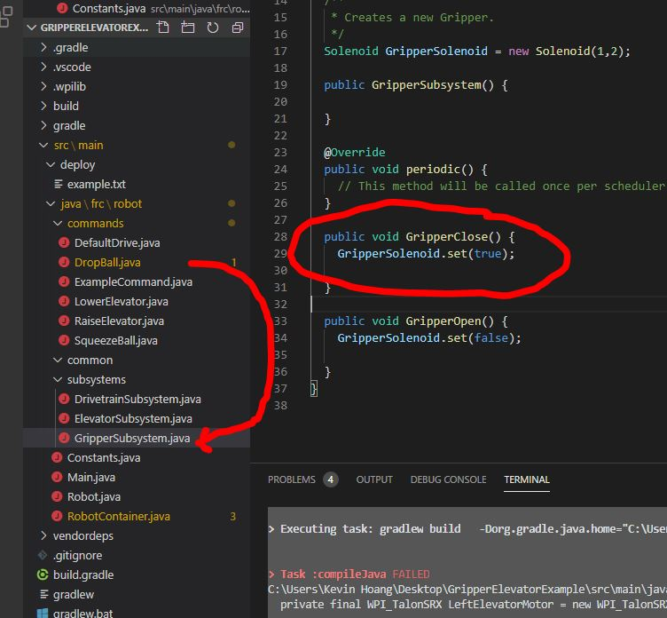

# Overview
Our team uses a CommandBase Code structure.     
Subsystems create objects required to control the robot.      
Inside the subsystems, methods execute specific tasks.

Commands are made to then run the method. 

**Understanding the code structure is the key to success**

## Code Structure

* **General Files**
	* `Constants.java` - Contains specific robot values (example: wheel diameters, calibration values, etcc)
	* `Main.java` - All java programs start from main. This main file starts Robot.java
	* `Robot.java`
	* `RobotContainer.java` 
		* 	Creates robots subsystems
		*	Assign commands to controller buttons
* **Command files** - Requests action from `subsystem files`
* **Subsystem files** - Contain all possible actions of the `subsystem`

## Program Flow

## Example Program flow

The command DropBall is assigned to controller button A on controller 1.        
When pressed, it will run the command DropBall located in Dropball.java.

The command DropBall, represented by `DropBall.java` calls a method from subsystem GripperSubsystem, which was initalized and named `m_GripperSubsystem` in the `RobotContainer.java`

The method GripperClose() in the subsystem `GripperSubsystem` contains the code that controls the solenoid, causing it to actuate.

