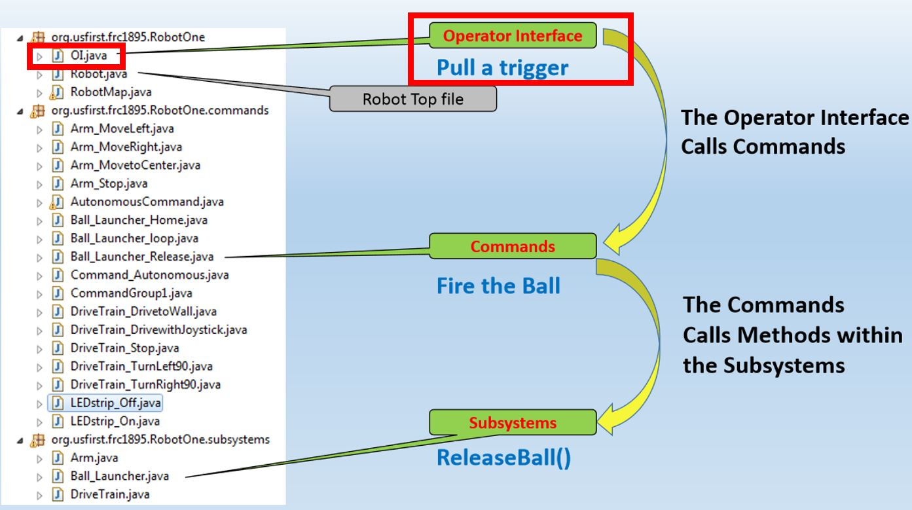

# Overview
Controllers are operated by human players in order to command the robot.
In this section, you will create the controller and button objects in Java.
If you have completed the [command section](commands.md), you can then assign commands to specific button.



## Creating a Joystick Object

The example below declares to the program that there is an object named CONTROLLERNAME that is a joystick.
This should be placed under **`public class OI`**. 
The port number tells the computer which USB slot this controller should be in.
```
Joystick CONTROLLERNAME = new Joystick(PORTNUMBER)
```

## Creating Button Objects

To create a **`button`**, you must declare the object and initialize it.
Declaring tells the program that there is an object named NAME that is a button. This should be placed under **`public OI`**.
Depending on the controller, each button (X,Y,A,B, etc.) is assigned to a number. 


```
JoystickButton buttonA_1 = new JoystickButton(CONTROLLERNAME,BUTTONNUMBER)
```
In the example above, we name the button `buttonA_1` to indicate that the button is **`A`** on **`controller 1`**.   

## Assigning Commands to Buttons

NOTE: To complete this section, you must have completed the [command section](commands.md) of the is guide.

First, you need to make sure the **`OI.java`** can access the command files.
To do this, add the following import code at the top of **`OI.java`** along with the other imports.

```
import frc.robot.commands.*;
```

Depending on your design, you may want your buttons to behave differently.
Here are 3 possible button types you can use, depending on your application.

###### whenPressed
Command starts when button is pressed, and it runs **until** the command's **`isFinished()`** method is satisfied.
```
BUTTONNAME.whenPressed(new ExampleCommand());
```


###### whileHeld (Most Common)
Command runs while button is held down, and is **interrupted** once the button is released. Note that interrupting a command does NOT automatically end it! You will need to modify the `interrupted()` method in the command
```
BUTTONNAME.whileHeld(new ExampleCommand());
```

###### whenReleased
Start command when button is released, and run **until** the command's **`isFinished()`** method is satisfied.
```
BUTTONNAME.whenReleased(new ExampleCommand());
```


## Example - Create controller and a button that will run the command raiseElevator

In the example below, `controller1` is assigned to usb port `0`.   
The `buttonY` corresponds to button `4` on the controller.
```
public class OI {
	Joystick Controller1 = newJoystick(0);	
	JoystickButton buttonY_1 = new JoystickButton(Controller1, 4);	
	
	
    public OI() {	
        buttonY_1.whileHeld(new raiseElevatorCommand());						
    }
}
```