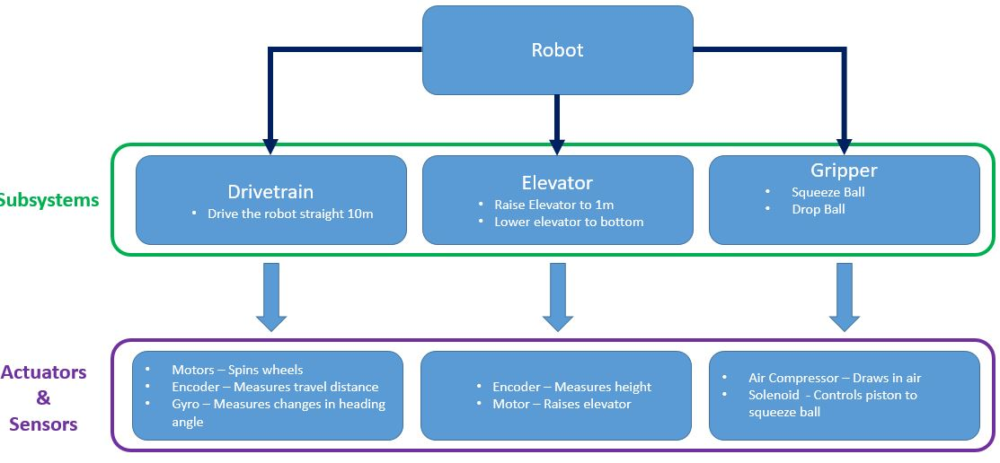

# Overview
This page summarizes the overall steps required to program a robot.    

## Design Phase
* Strategy - What is the team strategy for autonomous mode?
* Subsystems 
	* What subsystems will you have on your robot?
	* What does each subsystem need to do?  
	* What sensors should be used, if any?
	* How many actuators does each subsystem need?
* Controllers 
	* How many controllers is needed to control this robot?
	* What commands should be mapped to which buttons?

## Programming Phase
* Create Subsystem Classes
* Create objects 
* Create methods to execute tasks control
* Create commands that utilize methods 
* Autonomous routines need to be created

## Testing 
* Test code & fix bugs 
* Look for new ways to do things smarter and more efficiently
* **Golden Rule: Your code doesnt work until you've tested it on the robot **

## Example

Lets say the team decides to build a robot that uses a gripper to squeeze a ball, then uses an elevator to raise the ball.

###### Design Phase

###### Programming Phase

Need to create the following subsystems with the following objects

* **Subsystems**
	* Drivetrain
		* `motor controller`
		* `encoder`
		* `gyro`
	* Elevator
		* `motor controller`
		* `encoder`
	* Gripper
		* `solenoid`
		* `compressor`

After, the following commands need to be created for the corresponding subsystem

* **Commands**
	* Drivetrain
		* Autonomous Drive Straight
	* Elevator
		* Raise Elevator
		* Lower Elevator
		* Stop Elevator		
	* Gripper
		* Squeeze Ball
		* Drop Ball
		
Now that the robot structure is outlined, we can begin to code.   
Refer to the [Basic Robot Programming page](basics.md).

