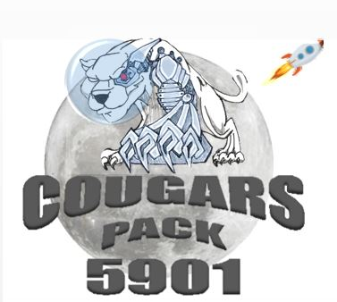

# Welcome to the Programming Guide!

This guide was written during the 2019 FRC season with several goals in mind:   

* Allow students to learn programming independently
* One-stop location for programming resources
* Store programming knowledge for future Cougars

If there are any mistakes, or anything is confusing please let me know.   
I am **always** looking for ways to do a better job.

Kevin Hoang - Team 5901 Lead Mentor    
kkhoang.57@gmail.com   

