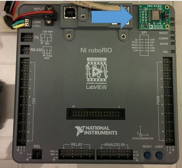
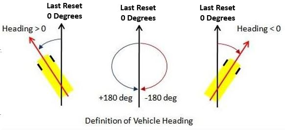
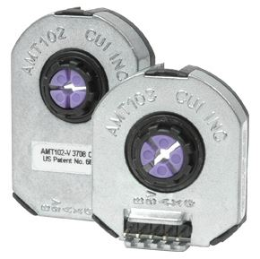

# Overview
Sensors are used to help the Robot understand the world around it.

## Gyros



Gyros measure heading of the robot to determine what direction it is going in.   
0 Degrees is defined as the angle the robot was facing when the gyro was last reset.



###### Declaration (under public class SUBSYSTEM extends Subsystem)
```
public static ADXRS450_Gyro GYRONAME;
```

###### Instantiation
```
GYRONAME = new ADXRS450_Gyro();
```

###### Usage

Function | Description | Example usage
---------|-------------|--------------
getAngle()| | get angle from gyro | <GYRONAME>.getAngle();
reset()| reset gyro heading to zero | <GYRONAME>.reset();	
GYRONAME.getAngle();	


##Encoders

Encoders count the revolutions of an axle.
By understanding how many times an axle/wheel rotates, we can estimate the distance traveled.

### AMT103-V - 5901's Drivetrain Encoder



5901 has used this encoder as a drivetrain encoder for years.

###### Declaration (under public class SUBSYSTEM extends Subsystem)
```	
public static Encoder leftEncoder;

```

###### Instantiation
```
leftEncoder = new Encoder(0, 1, false, Encoder.EncodingType.k1X);   
```

###### Parameter Setting
```
static double diameter = MEASURE_THIS; // inches
static double distancePerRev = diameter * Math.PI;    
static int ticksPerRev = 2048; // what you set them to , before was 2048

leftEncoder = new Encoder(0, 1, false, Encoder.EncodingType.k1X);        
leftEncoder.setDistancePerPulse(distancePerRev / ticksPerRev);      	
leftEncoder.setReverseDirection(true);		//Depends on if your mechanism runs counterclockwise or clockwise
leftEncoder.setMaxPeriod(.1);
leftEncoder.setMinRate(10);	
leftEncoder.setSamplesToAverage(7);
```
	
### CTRE Magnetic Encoder - 5901's Mechanism Encoder

###### Declaration (under public class SUBSYSTEM extends Subsystem)
```
None! CTRE encoders are wired directly into a TalonSRX, which serves as the object
```


###### Parameter Setting
```
TALONNAME.configSelectedFeedbackSensor(FeedbackDevice.CTRE_MagEncoder_Absolute, 0,0);
TALONNAME.configSelectedFeedbackSensor(FeedbackDevice.CTRE_MagEncoder_Relative, 0,0);
```
```

//Set current position to 0
int sensorPos=0;
elevatorEbony1.setSelectedSensorPosition(sensorPos, 0,10);

elevatorEbony1.configOpenloopRamp(1.5,0);
elevatorIvory7.configOpenloopRamp(1.5,0);

elevatorIvory7.set(com.ctre.phoenix.motorcontrol.ControlMode.Follower, 1);

elevatorEbony1.configForwardSoftLimitThreshold(36000,0);
elevatorEbony1.configReverseSoftLimitThreshold(0,0);
elevatorEbony1.configForwardSoftLimitEnable(true, 0);
elevatorEbony1.configReverseSoftLimitEnable(true, 0);

		elevatorEbony1.configNominalOutputForward(0, 0);
elevatorEbony1.configNominalOutputReverse(0, 0);
elevatorIvory7.configNominalOutputForward(0, 0);
elevatorIvory7.configNominalOutputReverse(0, 0);
elevatorEbony1.configPeakOutputForward(.5,0);    
elevatorEbony1.configPeakOutputReverse(-.5,0);
elevatorIvory7.configPeakOutputForward(.5,0);    
elevatorIvory7.configPeakOutputReverse(-.5,0);
```
# Limit Switch
```
public static DigitalInput elevatorUppyBoi6;
public static DigitalInput elevatorlowyBoi7;
elevatorUppyBoi6 = new DigitalInput(6);
		
```