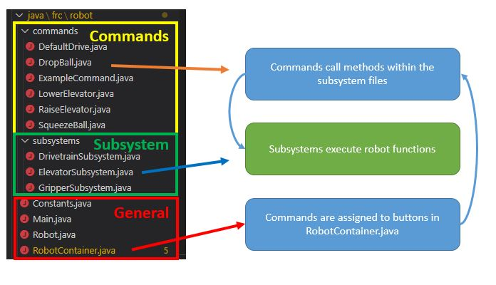
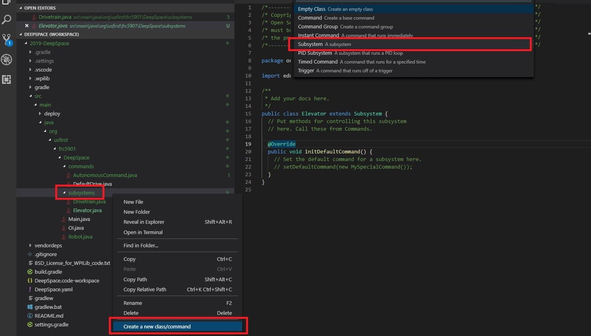

# Overview
Subsystems represent a major component of the robot, such as the drivetrain, an arm, or a shooter.
The methods (or functions) within a subsystem control specific motors. 

In this section, you will create a subsytem and create motor controller/sensor objects.
You will then create the methods that control these components.




## Creating Subsystems
To create a subsystem, right click subsystems in the explorer and select **`Create a new class/command `**.
Select  **`subsystem`**, and then name the subsystem appropriately.



After you have finished, you have created a subsystem.  
In the example below, I created a "Elevator" subsystem.


# Adding Motor Controllers/Sensors
Now that we have a subsystem, we will need to define the motor controllers and sensors.  
In Java, you must first create the object.  
There are two things you need to know:
* How many motor controllers do you need to add? (A 4 motor drivetrain requires 4 motor controllers)
* What type of motor controller is being used? (TalonSRX, VictorSPX, Sparks, etc.)


### If you are using TalonSRX


###### Declaration - Place this under public class NAME extends Subsystem
```
private WPI_TalonSRX leftElevatorMotor;
```


###### Instantiate/Initializing (create an object)       
The number corresponds to the CANId of the motor controller.

```
leftElevatorMotor = new WPI_TalonSRX(1);
```

### If you are using VictorSPX  


###### Declaration - Place this under public class NAME extends Subsystem
```
private WPI_VictorSPX leftElevatorMotor;
```

###### Instantiate/Initializing (create an object)    
The number corresponds to the CANId of the motor controller.
```
leftElevatorMotor = new WPI_VictorSPX(1);
```

## Creating Methods
A method is a function of the subsystem.
For example, some functions of an elevator may be to lift to a certain height, lower, or to stop.
To make an elevator stop, the example method is created to stop the elevator.

```
public void stopElevator(){
	leftElevatorMotor.set(0.0);
}
```

This sets the elevator motor that we created earlier at 0 percent voltage.

## Default Commands

Each subsystem can be assigned a default command. 
If a subsystem is not running anything, the default command will always be run.

**When would you want this?**
When you want something to always be running by default. For example, our drivetrain command always runs a `DefaultDrive` command that constantly checks to see if the joystick value has changed.

If you need to have a default command, add the following code to `public void initDefaultCommand()`

```
setDefaultCommand(new COMMANDNAME));
```

