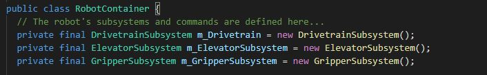
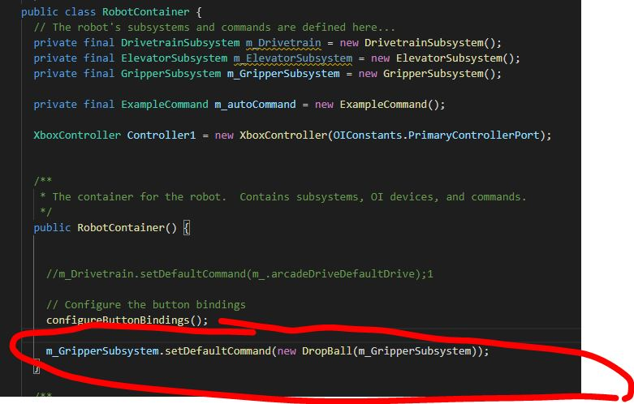

# Overview
Subsystems represent a major component of the robot, such as the drivetrain, an arm, or a shooter.
The methods (or functions) within a subsystem control specific motors. 

In this section, you will create a subsytem and create actuator/sensor objects.
You will then create the methods that control these components.


## Creating Subsystems
To create a subsystem, right click subsystems in the explorer and select **`Create a new class/command `**.     
Select  **`subsystem`**, and then name the subsystem using CamelCase, and suffixing with "Subsystem"  
 
**Example**: ElevatorSubsystem

After you are done, a .java file will be created under the subsystems folder corresponding with the name chosen.


The next step is to make sure when the Robot is initalized, the subsystem object is created.    
To do this, modify the `RobotContainer.java` with the following code and place this under the class declaration.

```
private final <Subsystem_Name> m_<Subsystem_Name> = new <Subsystem_Name>();
```

Your end result should look similar to the following, but specific to your robot:




## Default Commands - Do I need one?

Each subsystem can be assigned a default command.      
If a subsystem is not running anything, the default command will always be run.

**When would you want this?**
When you want something to always be running by default.     
For example, our drivetrain command always runs a `DefaultDrive` command that constantly checks to see if the joystick value has changed.

If you need to have a default command, add the following code in the constructor of RobotContainer:

```
<subsystemname>.setDefaultCommand(new command));
```


Example:



## Creating Actuator/Sensor Objects

Actuators and sensors belong to the subsystem, and varies depending on design.     
In our example, an elevator may be controlled by a `motor controller` and an `encoder`.
Every object must be created in the subsystem before it can be used.
   
See [Specialized Robot Code](objects.md) for additional details.


