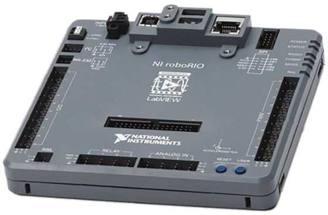
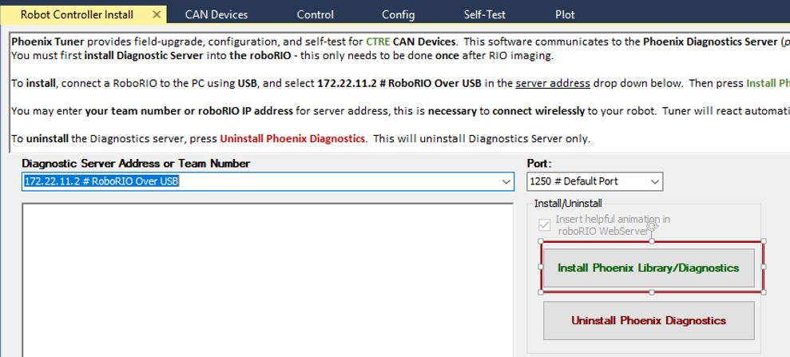
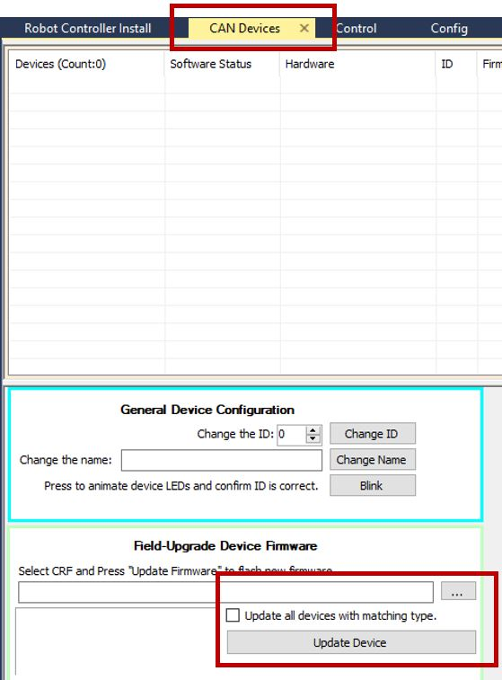
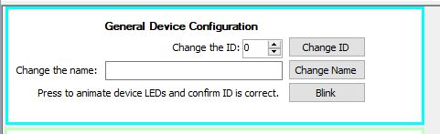
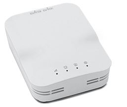

#Overview

Every year, new software is released.   
Our robot electronics need to be updated to have the latest changes.   

## Installing Java Development Environment##
We use the program VSCode to program our robot.   
This only needs to be done for new computers that do not have VSCode.

<https://wpilib.screenstepslive.com/s/currentCS/m/getting_started/l/999999-installing-c-and-java-development-tools-for-frc>

##Installing FRC Update Suite
FRC Suite includes all of the FRC specific updates for the season.   
You will need an NI account and the license key to complete this step.   
See lead mentor for this information.

<https://wpilib.screenstepslive.com/s/currentCS/m/getting_started/l/1004055-installing-the-frc-update-suite-all-languages>

##Imaging RoboRio

The RoboRio is the brain of the robot, and needs to be updated for the new season.
To do this step, the computer must have the FRC Update Suite installed.   
The RoboRio must also be correctly powered to the Power Distribution Panel.

<https://wpilib.screenstepslive.com/s/currentCS/m/getting_started/l/1009233-imaging-your-roborio>

##CTRE libraries and updating CAN Firmware
To do this step, the electrical board must be completely wired.

The CTRE library includes updates to software if you use TalonSRXs or Victor SPXs.

<http://www.ctr-electronics.com/control-system/hro.html#product_tabs_technical_resources>

Download and run the latest CTRE Pheonix Framework Installer.
To install the web plugin, plug in the usb cable for imaging the RoboRio into the computer and Roborio.
Open the Pheonix Tuner on the desktop, select roboRio upgrade tab, and select update Rio Web-based config

To update the CAN software, we need to download the firmware from CTR. Download the latest Talon SRX Firmware.
<http://www.ctr-electronics.com/talon-srx.html#product_tabs_technical_resources>

After doing that, go to the CAN devices tab in the Pheonix Tuner.
Select the firmware CRF file that you just downloaded, check the update all devices with matching type box, and then click update device.

## Assigning CAN IDs
To do this step, the electrical board must be completely wired.

Open the Pheonix Tuner from the desktop. Click on the CAN devices laptop.
You can select CAN devices from this window. If none appear, then there is a wiring issue with the CAN bus

At the bottom is a General Device Configuration window.   
Use this to change the ID of the motor controllers.    
Use the blink button to determine which controller is the one selected.

Number the motor controllers based on the following 5901 convention:   

* Left controllers - Odd numbers, from front to back (1,3,5,7, etc.)  
* Right controllers - Even numbers, from front to back (2,4,6,8, etc.)

##Imaging Radio
The Radio is how the laptop communicates to the Robot, and needs to be updated.

<https://wpilib.screenstepslive.com/s/currentCS/m/getting_started/l/144986-programming-your-radio>

