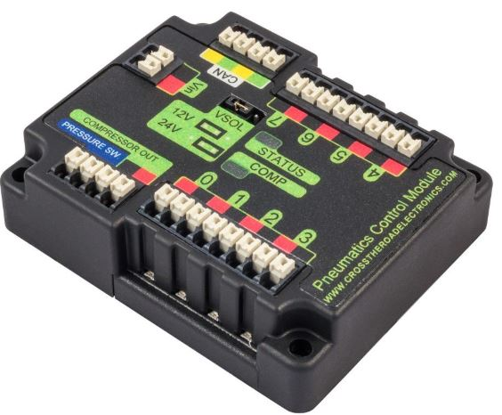
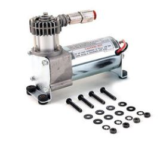

# Overview
This page summarizes the overall steps required to program a pneumatic system.
Pneumatics are controlled by the Pneumatic Control Module, which is wired to the pneumatic components.
Like any other actuator, the compressor and pneumatic solenoid (the thing that controls the cylinder ) need to be declared.



## Operating a compressor
A compressor pumps air into the system.



Instantiating a compressor
The number corresponds with the Pneumatic Control Module (PCM) Node ID
```
Compressor COMPRESSORNAME = new Compressor(0);
```

Starting a compressor

```
COMPRESSORNAME.setClosedLoopControl(true);
```

Stopping a compressor

```
COMPRESSORNAME.setClosedLoopControl(false);
```

## Reading compressor status
```
boolean enabled = COMPRESSORNAME.enabled
boolean pressureSwitch = COMPRESSORNAME.getPressureSwitchValue();
double current = COMPRESSORNAME.getCompressorCurrent();
```

## Single Solenoids

A single solenoid valve has one solenoid, and shifts when voltage is supplied to that solenoid.    
When voltage is removed, it shifts back to a “home” position.
```
Solenoid exampleSolenoid = newSolenoid(1);

exampleSolenoid.set(true);
exampleSolenoid.set(false);
```
The number corresponds with the Pneumatic Control Module (PCM) Node ID

## Double Solenoids
A double solenoid has two solenoids, and when voltage is supplied to one (and not the other) the valve shifts. 
What this means is that the cylinder has no home position, so when power is cut, the valve will stay where it was at that time, and the cylinder will continue to do work in the direction is was working in

Forward Channel - 1st channel, kforward
Reverse channel - 2nd channel, kReverse
```
DoubleSolenoid exampleDouble = new DoubleSolenoid(1, 2);

exampleDouble.set(DoubleSolenoid.Value.kOff);
exampleDouble.set(DoubleSolenoid.Value.kForward);
exampleDouble.set(DoubleSolenoid.Value.kReverse);
```
The number corresponds with the Pneumatic Control Module (PCM) Node ID
